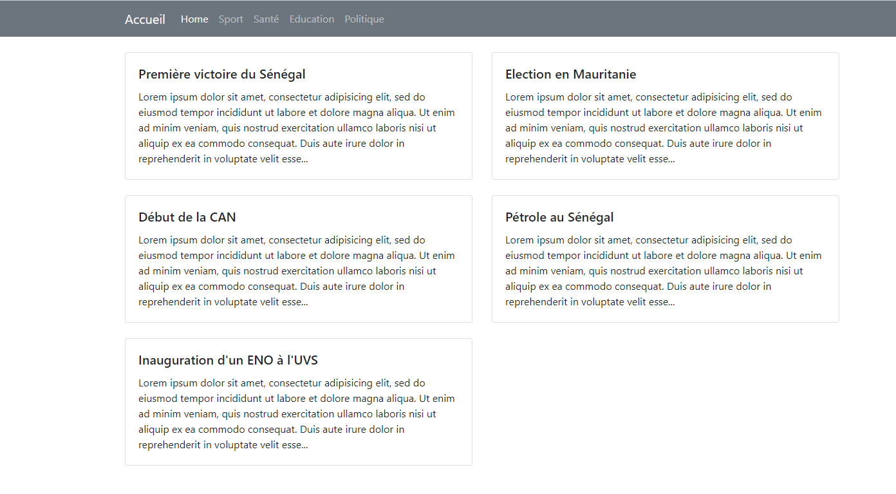

***Model***
Dans cette partie la création des classe Article et Catégorie qui reflete les élements de la table Article et Catégorie
Une connexion à la base de données avec DatabaseConnect 

***Controlleur***
Qui contient tous les logiques et redirection aux differents templates 

***Vue***
Nous permet les pages de notre site via une demande au Controlleur d'afficher les elements neccessaires à la base de données 

***Public***
Cet partie contient notre element principal au lancement de l'appl

***Lancer l'applicaton***
php -S localhost:7000 -t public

